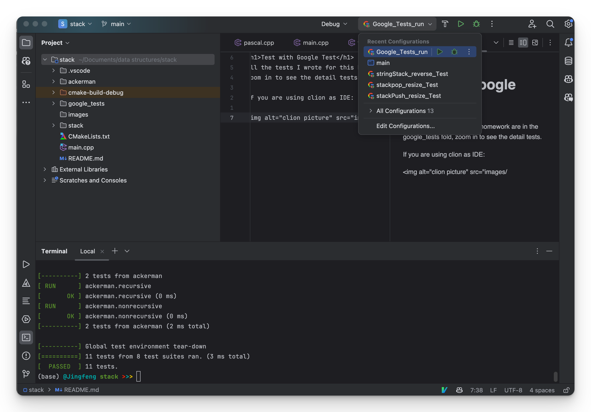
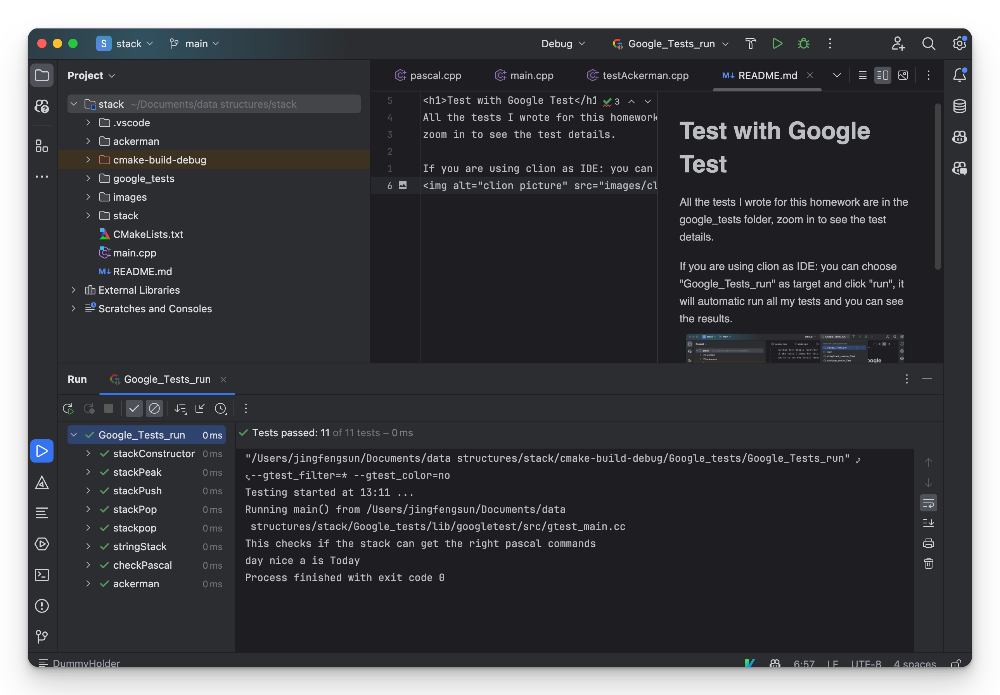

<h1>Test with Google Test</h1>
All the tests I wrote for this homework are in the google_tests folder,
zoom in to see the test details.

If you are using clion as IDE, you can choose "Google_Tests_run" as target and click "run", it will automatic run all my tests and you can see the results.



If you are not using clion as IDE, you can open terminal and switch to the root directory (stack) in this project. And run command:

```angular2html
./cmake-build-debug/Google_tests/Google_Tests_run
```
This will automaticly run all my tests in terminal.

For more information about Google tests, please refer to the link below.

<a href="https://google.github.io/googletest/primer.html">Google test Primer</a>
